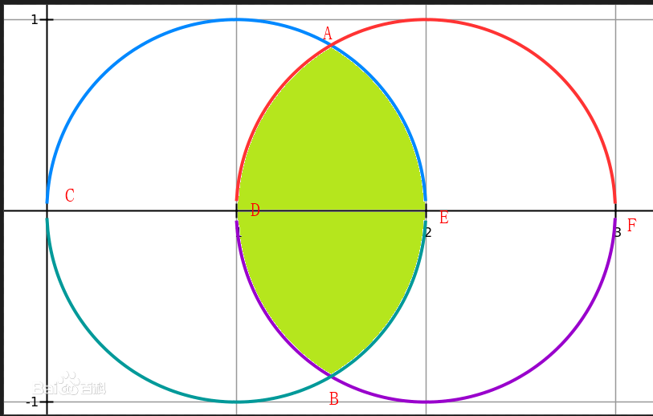

# 11-初识path

## path指令

* path

  * M = moveto
  * L = lineto
  * H = horizontal lineto
  * V = vertical lineto
  * C = curveto
  * S = smooth curveto
  * Q = quadratic Belzier curve
  * T = smooth quadratic Belzier curveto
  * A = elliptical Arc
  * Z = closepath

* 注意指令有大小写区分，代表的是绝对坐标和相对坐标
  * 比如拿H100，h100举例子
  * 首先H指令表示的是水平
  * H100表示水平移动到横坐标x坐标为100的地方
  * h100表示相对于当前点，水平移动100的距离  

* 这一节主要讲下A指令
  * 参数
    * rx - 椭圆的半径x的长度。
    * ry - 椭圆的半径y的长度。
    * x-axis-rotation - 椭圆相对于坐标系的旋转角度，角度数而非弧度数。
    * large-arc-flag 是标记绘制大弧(1)还是小弧(0)部分。
    * sweep-flag 是标记向顺时针(1)还是逆时针(0)方向绘制。
    * x - 是圆弧终点的坐标x。   
    * y - 是圆弧终点的坐标y。 
  * 讲解
    * 任意两个点可以连成一条线段
    * 如果一个圆的直径小于这2个点的距离的话，那么这个圆的圆弧是不可能同时穿过这2个点的
    * 如果一个圆的直径大于等于这2个点的距离的话，是可以穿过这2个点的
    * 接下去我们讨论直径大于2个点的情况，结合图来看

         

    * 如上图所示，经过A，B两点的弧线一共有4条，分别是
      * 弧ACB - 大弧，逆时针   
      * 弧ADB - 小弧，逆时针   
      * 弧AEB - 小弧，顺时针  
      * 弧AFB - 大弧，顺时针  
    * 所以比方我们要画ADB这个弧的画步骤应该是
      * M指令，移动到A点
      * A指令
        * rx ry值一致因为是圆
        * x-axis-rotation这个值只有椭圆的时候有用，因为圆不管怎么旋转都是一样的，椭圆的画比如横匾的椭圆竖起来就变成高瘦了，所以我们这里可以写0
        * large-arc-flag选择小弧
        * sweep-flag选择逆时针
        * x y就是B这个点
      * 这样弧线就画好了  

## 知道你还不过瘾

* [返回首页](../README.md)
* [上一节-10-动态创建折线](../10-动态创建折线/10-动态创建折线.md)